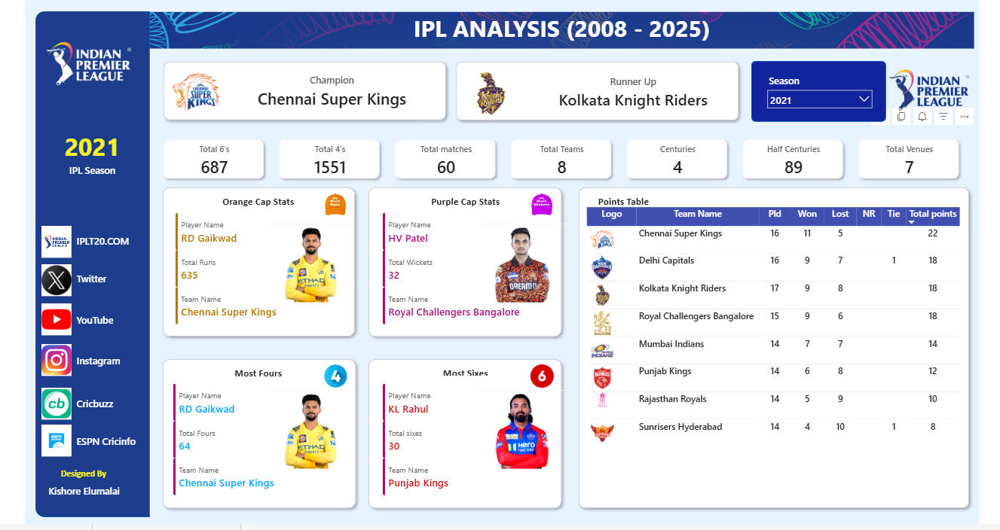

# 🏏 IPL Analysis Dashboard (2008–2025) | Power BI Project

An **interactive Power BI dashboard** built to analyze Indian Premier League (IPL) data from **2008 to 2025**.  
This project transforms raw cricket data into **clear, visual insights** about team performance, player achievements, and season statistics.

---

## 📊 Dashboard Overview

This dashboard provides a complete overview of each IPL season with interactive filters.

### 🔹 Season Summary
- Champion Team
- Runner-Up Team
- Total Matches
- Total Teams
- Total Venues

### 🔹 Batting Insights
- Total **6's**
- Total **4's**
- **Centuries**
- **Half Centuries**
- **Orange Cap Winner** (Highest Run Scorer)
- Player with **Most Fours**
- Player with **Most Sixes**

### 🔹 Bowling Insights
- **Purple Cap Winner** (Most Wickets in the Season)

### 🔹 Team Performance
- Interactive **Points Table**
- Matches Played
- Wins & Losses
- Total Points
- Team Logos

---

## 🧠 Key Features

- Interactive **Season Filter**
- Dynamic **Player Images**
- **Team Logos integrated using Image URLs**
- Advanced **DAX calculations**
- Clean and modern **dashboard design**
- Dynamic **KPIs and cards**

---

## 🛠 Tools & Technologies Used

- **Power BI**
- **DAX (Data Analysis Expressions)**
- **Data Modeling**
- **Power Query**
- **Image URL Integration**
- **Data Visualization**

---

## 📂 Dataset

The project uses IPL datasets containing:

- Match details
- Ball-by-ball data
- Player performance
- Team information

These datasets were used to calculate player stats, team standings, and season insights.

---

## 📷 Dashboard Preview

---

## 🚀 Project Goal

The goal of this project was to:

- Practice **real-world data analytics**
- Build an **interactive sports analytics dashboard**
- Learn **advanced DAX calculations**
- Improve **data visualization and storytelling skills**

---

## 📌 Future Improvements

- Player career statistics analysis
- Venue performance insights
- Head-to-head team comparison
- Advanced player performance metrics

---

## 👨‍💻 Author

**Kishore Elumalai**

Aspiring **Data Analyst** passionate about turning data into insights.

---

⭐ If you like this project, feel free to **star the repository**!
